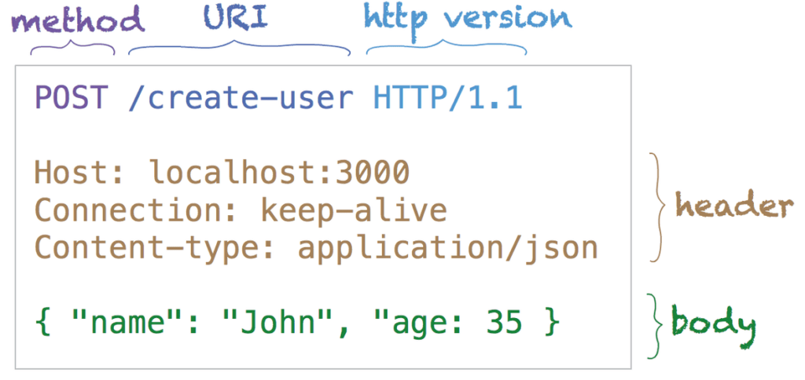
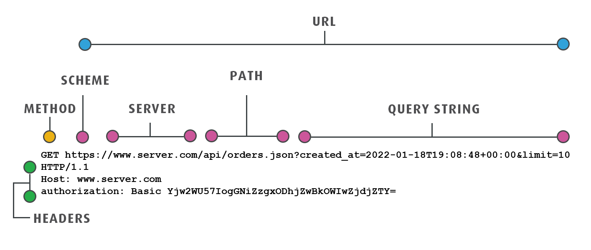

# Web Tutorial

## Ever wonder how the web works?


## What is a WebServer
A web server has to store the website's files, namely all HTML documents and their related assets, including images, CSS stylesheets, JavaScript files, fonts, etc.

## HTML templates
Refresh lagi tentang html
```html
<!DOCTYPE html>                     <!-->definisikan bahwa ini adalah sebuah dokumen html<-->
<html>                              <!-->definisi dokumen `root` / `paling atas`<-->
    <body>                          <!-->konten dari html page<-->
        <h1>Heading1</h1>           <!-->Sebuah Heading1<-->
        <p>paragraph</p>            <!-->Sebuah paragraf<-->
        <p>ini mulai paragraf ke 2</p>
        <a href="https://twitter.com">X</a>
        <br></br>                   <!-->sebuah line break<-->
        <h1>Heading1</h1> 
         <!-->mengembalikan sebuah image<-->
    </body>
</html>
```

References:
- [Essential HTML tags](https://www.geeksforgeeks.org/essential-html-tags/)
- [HTML Element Reference](https://www.w3schools.com/tags/ref_byfunc.asp)

## Flask pt.1
[Flask](https://flask.palletsprojects.com/en/stable/) is a web framework written in Python. Jadi bukan hanya webserver, tapi sebuah tool untuk membuat web applications.

### setup
1. activate `venv`
```
python3 -m venv kelas
source kelas/bin/activate
```
2. install requirements
```
python3 -m pip install Flask
```

1. import `flask`
```python
from flask import Flask
```

2. inisialisasi object `Flask`
```python
app = Flask(__name__)
```

3. definisikan sebuah `route` atau `path` dengan `function` atau `endpoint` yang akan kita jalankan
```python
@app.route('/')
def text():
    return "kembalikan sebuah text"
```

4. jalankan aplikasi
```python
app.run()
```

## Flask pt.2
Selain text, kita juga bisa return sebuah `html`

1. return sebuah `index.html`
```python
@app.route('/index.html')
def serve_index():
    f = open('index.html', 'rb')
    return f.read()
```

2. Quiz, coba kembalikan sebuah gambar kucing

3. Quiz, coba kembalikan sebuah dokumen singkat, berisikan:
    - Gambar personil band favorit anda
    - Judul lagu favorit dari mereka
    - Cuplikan lirik favorit

## Anatomy of an HTTP request
<br>


- URL/URI = Uniform Resource Identifier/Locator
- Method = Mengindikasikan request intent
- Headers = Metadata, key-value pair data
- Body = Data dalam request
- Query / Parameters = Data dalam bentuk URL

Next Part: [Part 2](./materi-2024-11-23.md)