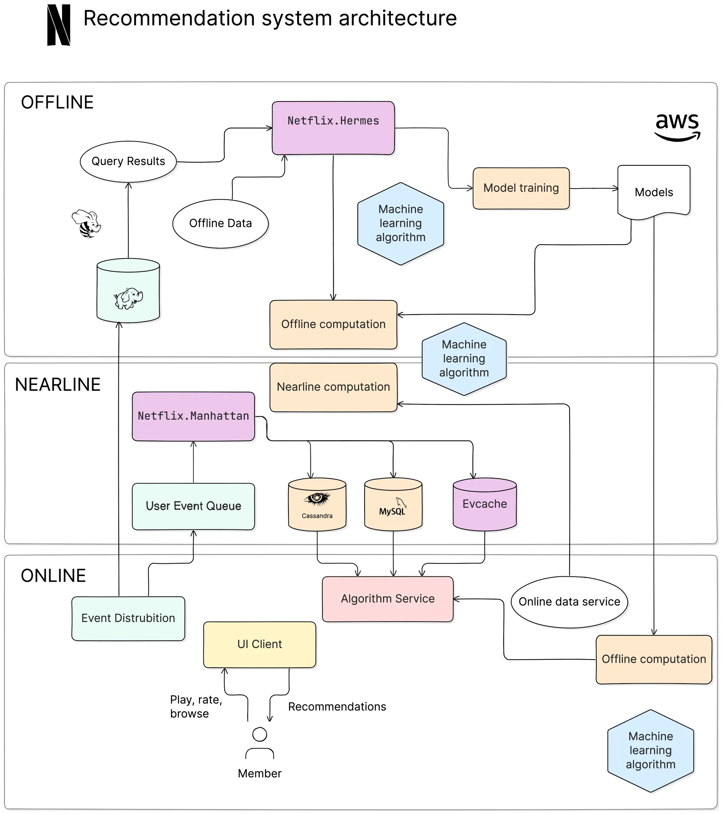

# Perkenalan system architecture

# Tools
[excalidraw.com](https://excalidraw.com)

# Contoh ide
1. Hari ini kita coba untuk brainstorming dulu ke depan kita mau membuat apa
    * aplikasi reading email
    * aplikasi reading dbf menjadi SQL

2. Di excalidraw, kita pisahkan dulu komponen ada apa saja
    * Frontend
        * streamlit
        * graphs pakai matplotlib + seaborn
    * Backend (contoh pakai flask)
        * endpoints ada apa saja (/routes)
    * Apakah perlu serving files juga?
        * bisa pakai flask, atau pakai webserver lain
    * Database
        * misalkan pakai MSSQL atau PostgreSQL
    
# Scripts/Programs
Seperti yang kita pelajari, aplikasi itu tidak harus selalu berbentuk frontend.

Bisa saja bentuknya hanya sebatas script yang bisa dijalankan beberapa kali sehari. Atau ketika di-execute saja oleh user

Nah, misalkan kita punya sebuah program yang ingin dijalankan setiap beberapa saat. Di linux ada yang namanya `cron` (kalau di windows ada `scheduled tasks`). Kita bisa lihat cheat website pemakaian `cron` di [crontab.guru](https://crontab.guru/)

# API
Adapun API (Application Programming Interface), yaitu sebuah dokumen yang mendefinisikan cara berinteraksi dengan sebuah program.

Contoh, ketika kita memiliki sebuah aplikasi Flask, kita harus mendefinisikan ada endpoints apa saja di dalam dokumen API. Tujuannya dibuatkan dokumen ini agar pengguna aplikasi Flask kita bisa memahami cara memakai aplikasi Flask tersebut