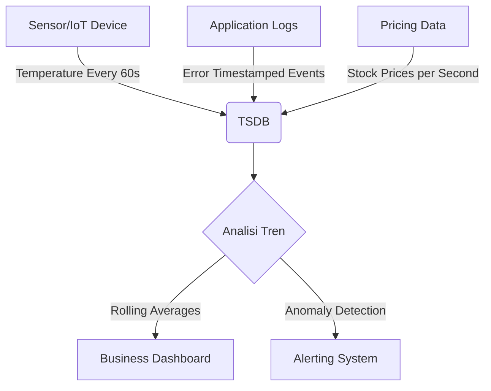

# 📚 Database Lengkap: SQL vs NoSQL vs TimeSeries

Panduan komprehensif tentang teknologi database modern yang menggabungkan wawasan praktis dari pengalaman nyata dengan panduan teknis mendalam. Materi ini merupakan penggabungan pembelajaran dari sesi 05-03 dan 05-09 menjadi satu keutuhan yang solid untuk memahami memilih dan menggunakan database yang tepat untuk berbagai use case.

***

## 📝 Daftar Isi

1. [Pendahuluan & Prasyarat](#pengenalan)
2. [Personal Experience: Kenapa SQL > NoSQL untuk Most Use Cases](#personal-experience-kenapa-sql-no-sqr-untuk-most-use-cases)
3. [Deep Dive: Perbandingan Mendalam SQL vs NoSQL](#perbandingan-mendalam-sql-vs-nosql)
4. [Modul 1: Fundamentals - Apa itu Database?](#fundamentals-apa-itu-database)
5. [Modul 2: SQL dengan SQLite - Praktis & Ringan](#modul-1-sql-dengan-sqlite-praktis-ringan)
6. [Modul 3: PostgreSQL Advanced Features](#modul-2-postgresql-advanced-features)
7. [Modul 4: NoSQL Patterns dengan SQLite JSON + Modern Extensions](#modul-3-nosql-patterns-dengan-sqlite-json-modern-extensions)
8. [Time-Series Database & TSDB Comparison](#timeseries-timeseries-database-t-sdb-comparison)
9. [Best Practices & Production Ready](#best-practices-production-ready)
10. [Decision Matrix: Memilih Database yang Tepat](#decision-matrix-memilih-database-yang-tepat)
11. [Latihan & Project](#latihan-project)
12. [Resources](#resources)

***

## Pengenalan {#pengenalan}

Sesi ini akan membahas berbagai aspek database, perbedaan mendasar antara SQL (relational) dan NoSQL (non-relational), kapan menggunakan masing-masing, serta panduan mendalam tentang Time-Series Database untuk data temporal yang masif.

**Durasi:** 4 Jam (Gabungan dari kedua sesi)

### Prasyarat
- Pemahaman dasar Python programming
- Pengetahuan minimal tentang struktur data (list, dict, tuple)
- Komputer dengan akses internet untuk instalasi

### Tujuan Pembelajaran
Setelah mempelajari materi ini, Anda diharapkan dapat:

1. Memahami perbedaan mendasar SQL vs NoSQL vs TimeSeries
2. Memilih database yang tepat untuk berbagai use case
3. Membangun koneksi ke database SQLite, PostgreSQL, dan TSDB
4. Membuat skema database yang sesuai dengan kebutuhan aplikasi
5. Melakukan operasi CRUD (Create, Read, Update, Delete)
6. Mendemonstrasikan kelebihan dan kekurangan masing-masing jenis database
7. Menerapkan best practices untuk production-ready applications

***

## Personal Experience: Kenapa SQL > NoSQL untuk Most Use Cases {#personal-experience-kenapa-sql-no-sqr-untuk-most-use-cases}

### 🎓 Pengalaman Praktis dengan Database Engine

Saya punya pengalaman praktis dengan berbagai database engine yang sudah dipakai dalam proyek-proyek produksi:

1. **PostgreSQL** - Paling performant untuk production (lihat benchmark online)
2. **Elasticsearch** - Pakai sebagai frontend search engine untuk Kibana dashboard, data utama masih di PostgreSQL
3. **Milvus** - Pernah cek untuk vector search, tapi pgvector sudah cukup jadi Milvus obsolete
4. **SQLite** - Untuk aplikasi ringan/embedded atau development quick start
5. **ObjectBox** - Sedang explore (lightweight NoSQL Python)

### ✅ Kenapa Pakai SQL/PostgreSQL sebagai Primary Database?

- **Performant**: Seiring perkembangan teknologi, PostgreSQL terbukti paling performant dibanding MySQL/MariaDB
- **Jsonb Support**: Powerful untuk query semi-structured data + relasi kompleks dalam satu database
- **Familiarity**: Tidak perlu pindah ke NoSQL jika sudah familiar dengan PostgreSQL

### 🎯 Personal Pattern Saya

Jika belum tau apakah data butuh relasi atau tidak, saya mostly pakai cuma 2 kolom:

```python
# timestampz + jsonb untuk flexible storage:
CREATE TABLE flexible_data (
    id INTEGER PRIMARY KEY AUTOINCREMENT,
    created_at TIMESTAMPTZ NOT NULL DEFAULT CURRENT_TIMESTAMP AT TIME ZONE 'utc',
    data JSONB NOT NULL  -- Bisa query isi jsonb-nya langsung!
)
```

**TL;DR**: Jika project butuh reliable + performant dan sudah familiar PostgreSQL, pakai PostgreSQL + jsonb. Tidak perlu repot ke NoSQL untuk kebanyakan modern use cases.

***

## Perbandingan Mendalam: SQL vs NoSQL vs TimeSeries {#perbandingan-mendalam-sql-vs-nosql}

### 🐘 SQL (Relational): Struktur & Integritas

**Prinsip Utama:** Data disimpan dalam tabel terstruktur dengan skema kaku dan hubungan antar-tabel (Schema-on-Write).

#### ACID Properties: Pilar Integritas Data

| Properti | Penjelasan | Contoh Kasus |
|----------|------------|-------------|
| **A**tomicity | Transaksi all or nothing | Transfer uang A→B rollback jika gagal |
| **C**onsistency | Valid state → valid state | Stok tidak boleh negatif |
| **I**solation | Concurrent = Sequential appearance | Dua user order item terakhir |
| **D**urability | Commit = permanent | Email konfirmasi pembelian tersimpan |

#### 🛡️ PostgreSQL untuk ACID:
- ✅ **Atomicity & Consistency**: Transaksi SQL (`BEGIN`/`COMMIT`) dengan rollback otomatis
- ✅ **Isolation**: Tingkat isolasi ketat (SERIALIZABLE) mencegah concurrency anomalies
- ✅ **Durability**: WAL (Write Ahead Log) ke disk fisik pastikan data commit bertahan

### 🧩 NoSQL (Non-Relational): Fleksibilitas & Skala

**Prinsip Utama:** Model data bervariasi (Dokumen, Key-Value, Graph). Prioritas: Skalabilitas Horizontal.

#### ✅ Keunggulan NoSQL:
- 🚀 **Skema Dinamis**: Adaptasi perubahan fitur tanpa downtime
- ☁️ **Horizontal Scale Otomatis**: Didistribusikan ke banyak server commodity hardware
- ⚡ **Kinerja I/O Sederhana**: Cepat untuk operasi baca/tulis sederhana skala besar

#### ⚠️ Catatan Penting: Polyglot Persistence

Berkat fitur modern seperti **JSONB** dan `pgvector` di PostgreSQL, kebutuhan NoSQL seringkali bisa dipenuhi *di dalam* sistem SQL yang terpercaya!

### ⏰ Time-Series DB (TSDB): Spesialisasi Waktu

**Kapan Digunakan:** Ketika data utama Anda adalah metrik yang diindeks oleh waktu (Sensor IoT, Log Aplikasi, Harga Saham).

**Fokus Query:** Analisis tren (`AVG`, `MAX`) dalam rentang waktu tertentu.

### ❓ Kenapa Tidak Pakai Elasticsearch untuk Time-Series?

| Aspek | Kelemahan ES | Solusi TSDB |
|-------|--------------|-------------|
| ACID | ❌ Tidak ada transaksi penuh | ✅ Full ACID support |
| Joins | ❌ Butuh denormalisasi berat | ✅ JOIN SQL native |
| Storage | 📁 Inverted index besar | ☑️ Column compression efisien |
| Query Language | 🤕 Query DSL JSON kompleks | 🎯 SQL ekspresif untuk analytics |

***

## Fundamentals: Apa itu Database? {#fundamentals-apa-itu-database}

### Definisi Dasar

**Database** adalah tempat menyimpan data secara terstruktur yang dapat diakses melalui program komputer.

### Perbandingan SQL vs NoSQL Summary Table

| Aspek | SQL (Relational) | NoSQL |
|-------|------------------|-------|
| **Konsistensi** | High consistency (ACID) | Eventual consistency (BASE) |
| **Scalability** | Vertical scaling (tambah RAM/CPU/server upgrade) | Horizontal scaling (tambah node cluster) |
| **Query Language** | SQL (standardized) | API spesifik / query custom |
| **Schema** | Fixed, rigid schema | Flexible/dynamic schema |
| **Use Case** | Data relasi kompleks, transaksi finansial, reporting analytical | Big data, real-time analytics, content management |

### Metadata Database Engine: Perbandingan Mendalam

| Feature | SQL (Relational) | NoSQL (Non-Relational) | Time-Series DB |
|---------|------------------|------------------------|----------------|
| **Data Model** | Rigid, predefined schema tables | Dynamic, flexible schema | Time-partitioned columns |
| **Scaling** | Vertical (bigger server hardware upgrade) | Horizontal (more nodes cluster out) | Time-based auto partitioning |
| **Consistency** | ACID compliance | BASE - eventual consistency | Hybrid: ACID transactions + retention policies |
| **Complexity** | Best for complex joins/queries | Best for simple, fast key-value access | Optimized time-range queries |
| **Examples** | PostgreSQL, MySQL, SQLite | MongoDB, Cassandra, Redis | InfluxDB, TimescaleDB |

### Key Reasons to Choose NoSQL:

#### 📦 Massive Horizontal Scalability
NoSQL databases designed untuk "scale out" by adding more servers ke cluster, making them more cost-effective untuk big data applications dibandingkan vertical "scale up" yang lebih powerful hardware.

#### 🔧 Schema Flexibility
Do not need define rigid data structure upfront. Ini memungkinkan rapid development & frequent changes ke data model tanpa downtime atau complex migrations.

#### ⚡ High Performance untuk Simple Queries
By avoiding complexe table joins & normalizing data, NoSQL dapat offer faster read/write speeds buat large-scale, high-velocity workloads like real-time analytics atau social media feeds.

#### 📝 Diverse Data Types
NoSQL excels storing unstructured or semi-structured data (e.g., JSON, XML, images, sensor data) yang tidak fit ke dalam rows & columns traditional relational tables.

### Common Use Cases untuk NoSQL vs SQL:

| Application Type | Database Pilihan | Alasan |
|------------------|-----------------|--------|
| **Real-Time Big Data** | NoSQL | Handles high-velocity data dari IoT sensors atau log files |
| **Content Management** | NoSQL/Couchbase | Flexible schema untuk varied metadata buat videos, images & posts |
| **Social Networks** | Graph DB (Neo4j) | Efficiently map complex, interconnected user relationships |
| **E-commerce Catalogs** | NoSQL (MongoDB) | Accommodates products dengan highly varying attributes |
| **Mobile Apps** | NoSQL (Firebase/Realm) | Rapid iteration & offline data syncing dengan flexible JSON documents |

### Decision Flow - Database Selection:

```
              Apaan?
                ↓
    ┌────────────┴────────────┐
    │  Konsistensi ACID Penting?│
    │   YA → SQL (PostgreSQL)|
    │   TIDAK → Lihat ke bawah  │
    └────────────┬─────────────┘
                 ↓
    Apakah skema sering berubah?
        ├─ YA ─→ NoSQL/JSONB di Postgres
        └─ TIDAK ─→ Lanjut lihat skala
                 ↓
     Kebutuhan skalanya seperti apa?
        ├─ Besar ─→ Pure NoSQL
        │            (MongoDB, Cassandra)
        └─ Sedang → SQL (PostgreSQL)
                     + JSONB/Extensions
```

***

## Modul 2: SQL dengan SQLite - Database File-Based Ringan {#modul-1-sql-dengan-sqlite-praktis-ringan}

### 2.1 Instalasi Python SQLite

SQLite biasanya sudah included dalam Python standar library! Tidak perlu instalasi tambahan:

```bash
python -c "import sqlite3; print(sqlite3.sqlite_version)"
```

### 2.2 Membuat Database Pertama Anda

```python
import sqlite3

# Connect ke database (file dibuat otomatis jika belum ada)
conn = sqlite3.connect('users.db')
cursor = conn.cursor()

# Buat tabel dengan PRIMARY KEY AUTOINCREMENT dan default values
cursor.execute('''
CREATE TABLE users (
    id INTEGER PRIMARY KEY AUTOINCREMENT,
    username TEXT UNIQUE NOT NULL,
    email TEXT NOT NULL UNIQUE,
    full_name TEXT,
    created_at TIMESTAMP DEFAULT CURRENT_TIMESTAMP,
    is_active BOOLEAN DEFAULT 1
)
''')

# Tambah user pertama dengan parameterized query (SECURITY!)
cursor.execute(
    'INSERT INTO users (username, email, full_name) VALUES (?, ?, ?)',
    ('budi_santa', 'budi@luqmanr.xyz', 'Budi Santoso')
)

conn.commit()

# Verify data dengan SELECT
cursor.execute('SELECT * FROM users WHERE is_active = 1')
print(cursor.fetchall())

conn.close()
```

### 2.3 Membuat Database Relasional Lengkap: E-Commerce Sederhana

```python
import sqlite3

def create_ecommerce_database():
    conn = sqlite3.connect('ecommerce.db')
    cursor = conn.cursor()
    
    # Tabel Users - Data master untuk pelanggan
    cursor.execute('''
    CREATE TABLE IF NOT EXISTS users (
        id INTEGER PRIMARY KEY AUTOINCREMENT,
        username TEXT UNIQUE NOT NULL,
        email TEXT UNIQUE NOT NULL,
        password_hash TEXT NOT NULL,  # NEVER store plain text passwords!
        full_name TEXT,
        created_at TIMESTAMP DEFAULT CURRENT_TIMESTAMP
    )
    ''')
    
    # Tabel Posts - Konten yang diposting user (bukan owner)
    cursor.execute('''
    CREATE TABLE IF NOT EXISTS posts (
        id INTEGER PRIMARY KEY AUTOINCREMENT,
        title TEXT NOT NULL,
        content TEXT NOT NULL,
        author_id INTEGER NOT NULL,
        created_at TIMESTAMP DEFAULT CURRENT_TIMESTAMP,
        views_count INTEGER DEFAULT 0,
        FOREIGN KEY (author_id) REFERENCES users(id)
    )
    ''')
    
    # Tabel Comments - Relasi dengan posts
    cursor.execute('''
    CREATE TABLE IF NOT EXISTS comments (
        id INTEGER PRIMARY KEY AUTOINCREMENT,
        post_id INTEGER NOT NULL,
        author_username TEXT NOT NULL,
        content TEXT NOT NULL,
        likes_count INTEGER DEFAULT 0,
        created_at TIMESTAMP DEFAULT CURRENT_TIMESTAMP,
        FOREIGN KEY (post_id) REFERENCES posts(id)
    )
    ''')
    
    # Tabel Tags - Metadata untuk kategorisasi
    cursor.execute('''
    CREATE TABLE IF NOT EXISTS post_tags (
        id INTEGER PRIMARY KEY AUTOINCREMENT,
        post_id INTEGER NOT NULL,
        tag_name TEXT NOT NULL,
        created_at TIMESTAMP DEFAULT CURRENT_TIMESTAMP,
        FOREIGN KEY (post_id) REFERENCES posts(id)
    )
    ''')
    
    conn.commit()
    return conn
    
# Buat dan initialize database
db = create_ecommerce_database()

# Insert sample data dengan parameterized queries
cursor = db.cursor()

# Tambah user pertama
cursor.execute(
    'INSERT INTO users (username, email, password_hash, full_name) VALUES (?, ?, ?, ?)',
    ('john_doe', 'john@example.com', '$2b$12$ABC...', 'John Doe')
)

# Insert first post
cursor.execute('''
INSERT INTO posts (title, content, author_id) 
VALUES (?, ?, ?)
''',
('Belajar Python dengan SQLite',
'`SQLite` adalah database file-based yang ringan dan mudah digunakan. \n\nDalam tutorial ini, kita akan belajar berbagai aspek dari SQL vs NoSQL.',
1)
)

# Insert comments dengan post_id dinamis
post_id = db.lastrowid  # Capture last inserted ID
cursor.execute('''
INSERT INTO comments (post_id, author_username, content, likes_count)
VALUES (?, ?, ?, ?)
''',
(post_id,
 'Ini tutorial pertama saya!',
 'Tutorial ini sangat bagus dan informatif!',
 12345
)
)

db.close()
```

### 2.4 Operasi CRUD Lengkap dengan SQL Parameters Security

#### 🔓 CREATE (INSERT): Menambah Data Baru

```python
import sqlite3

conn = sqlite3.connect('blog.db')
cursor = conn.cursor()

# Buat tabel baru dengan kolom opsional vs wajib
cursor.execute('''
CREATE TABLE IF NOT EXISTS articles (
    id INTEGER PRIMARY KEY AUTOINCREMENT,
    title TEXT NOT NULL,
    summary TEXT,                -- Optional field
    body TEXT NOT NULL,          -- Required content
    author TEXT NOT NULL,
    published BOOLEAN DEFAULT 0, -- Status publishing
    views_count INTEGER DEFAULT 0,
    created_at TIMESTAMP DEFAULT CURRENT_TIMESTAMP,
    updated_at TIMESTAMP
)
''')

# INSERT dengan parameterized query (Mencegah SQL Injection!)
cursor.execute(
    'INSERT INTO articles (title, summary, body, author, published) VALUES (?, ?, ?, ?, ?)',
    (
        'Tutorial Database Python SQLite',
        'Belajar SQL menggunakan SQLite3 library built-in',  
        '''SQLite adalah embedded database yang sangat powerful. \n\nDalam tutorial ini, kita akan membahas:\n- Konsep dasar SQL vs NoSQL\n- CRUD operations best practices\n- Production-ready patterns''',
        'Tutorial Team',
        0  # Draft dulu sebelum publish
    )
)

conn.commit()
new_id = cursor.lastrowid  # Get auto-generated ID from last insert
print(f"✅ Artikel berhasil ditambahkan dengan ID: {new_id}")
```

#### 🔍 READ (SELECT): Berbagai Jenis Query

```python
cursor = conn.cursor()

# 📌 BASIC SELECT - Fetch all rows
cursor.execute('SELECT * FROM articles ORDER BY created_at DESC LIMIT 10')
rows = cursor.fetchall()

print(f"\nTotal {len(rows)} artikel tersedia:")
if rows:
    print(f"Latest title: {rows[-1][1][:50]}...")

# 📑 WITH COLUMN NAMES - More readable output
for row in rows:
    print({
        'id': row[0],
        'title': row[1],
        'summary': row[2] if len(row) > 2 and row[2] else None,  
        'published': bool(row.get(5)),  # Skip if index out of range
        'views': row.get(6, 0) if len(row) > 6 else 0,
        'created_at': row[-1] if len(row) > 9 else None
    })

# 🔎 SELECT DENGAN FILTER - Where clause with conditions
cursor.execute('SELECT * FROM articles WHERE published = 1')
published_articles = cursor.fetchall()
print(f"\n📖 {len(published_articles)} artikel published")

# 🔗 INNER JOIN - Menggabungkan data dari multiple tables untuk complex queries
cursor.execute('''
SELECT p.title, u.full_name AS author_name, COUNT(c.id) AS comment_count, 
       SUM(c.likes_count) AS total_likes
FROM posts p
LEFT JOIN users u ON p.author_id = u.id
LEFT JOIN comments c ON p.id = c.post_id
WHERE p.published = 1
GROUP BY p.id, p.title, u.full_name
ORDER BY total_likes DESC
LIMIT 5
''')

print(f"\n🏆 Top 5 Posts dengan most likes:")
for row in cursor.fetchall():
    print(row)
```

#### 🔄 UPDATE: Modifikasi Data yang Sudah Ada

```python
# ✏️ UPDATE SATU FIELD - Simple update single column
cursor.execute(
    'UPDATE articles SET published = 1 WHERE id = ?',
    (new_id,)
)
if cursor.rowcount > 0:
    print(f"✅ Published {cursor.rowcount} article(s)")

# 📊 UPDATE DENGAN CONDITION COMPLEX - Batch updates with filters
cursor.execute('''
UPDATE articles 
SET views_count = views_count + 1, 
    updated_at = CURRENT_TIMESTAMP
WHERE title LIKE '%Python%' AND is_draft = 0
''')
print(f"🔍 Updated {cursor.rowcount} Python article(s) with new views")

# 📝 MASS UPDATE dengan multiple statements - Efficient bulk operations
updates = [
    {'id': 1, 'views_count': 157},
    {'id': 2, 'views_count': 203},
    {'id': 3, 'views_count': 89}
]

# executemany lebih cepat untuk batch updates (vs multiple execute calls)
cursor.executemany(
    'UPDATE articles SET views_count = ? WHERE id = ?',
    [(update['views_count'], update['id']) for update in updates]
)
conn.commit()
print(f"📈 Updated {len(updates)} article records with new view counts")
```

#### 🗑️ DELETE: Menghapus Data dengan Strategi Tepat

```python
# 🗑️ HAPUS DENGAN ID - Hard delete (permanen, gunakan hati-hati!)
cursor.execute('DELETE FROM articles WHERE id = ?', (new_id,))
if cursor.rowcount != 0:
    conn.commit()  # Commit hanya jika ada row yang terhapus
    print(f"❌ Deleted {cursor.rowcount} record(s)")

# 🎯 HAPUS BERBASIS CONDITION - Remove based on business criteria
# Hapus comments dengan likes count rendah (cleanup spam)
cursor.execute('DELETE FROM comments WHERE likes_count < ?', (5,))
print(f"🧹 Removed {cursor.rowcount} low engagement comment(s)")

# 📁 SOFT DELETE - Best Practice! Keep data but mark as deleted
# Untuk audit trail dan compliance requirements
cursor.execute('''
UPDATE articles 
SET is_deleted = 1, deleted_at = CURRENT_TIMESTAMP, 
    title_title = title, body_body = body,  -- Backup sebelum delete
    author = NULL, published = 0
WHERE id = ? AND is_deleted = 0
''', (some_id_to_delete,) if 'some_id_to_delete' in dir() else None)

# 🔥 PERMANENT DELETE HANYAK BARU DILAKUKAN jika yakin:
if cursor.rowcount != 0 and not any(confirmation_required_conditions):
    conn.commit()
    print("⚠️  Permanent deletion requires confirmation!")
```

#### 📋 SELECT dengan Parameter untuk Security Against SQL Injection

```python
# 🔒 BAD - SQL INJECTION VULNERABLE! DONT DO THIS:
vulnerable_input = input_search_email_from_user("")  # Get from untrusted source
cursor.execute(f"SELECT * FROM users WHERE email LIKE '%{vulnerable_input}%'")
# Attack: ' OR '1'='1 UNION SELECT password,credit_card FROM sensitive -- drop table admins

# ✅ GOOD - Selalu gunakan parameterized queries untuk prevent injection!:
email_search_term = "%" + vulenerable_input  # Clean input first if needed
cursor.execute('SELECT * FROM users WHERE email LIKE ?', (email_search_term,))

# ✅ GOOD - Multiple parameters with complex conditions:
user_id_from_config = 5  # Should be validated/typed
search_pattern = "%Python%"  # Input sanitization recommended
cursor.execute(
    'SELECT title FROM articles WHERE id = ? AND title LIKE ? AND published = 1',
    (user_id_from_config, search_pattern)
)

# 🔒 BAD vs GOOD Comparison:
print("Bad query pattern:")  
print('  SELECT * FROM users WHERE email = "' + user_input + '"')      # ⚠️ INJECTION!
print("\nGood query pattern:" )     
cursor.execute('SELECT * FROM users WHERE email = ? OR email = ?', (user_input,))  # ✅ Safe
```

***

## Modul 2: PostgreSQL Advanced Features & Modern SQL {#modul-2-postgresql-advanced-features}

### 3.1 PostgreSQL vs MySQL: Why I Prefer Postgres

#### 🏆 Performant Engine Selection

PostgreSQL telah membuktikan dirinya sebagai **paling performant** engine database untuk production workloads (lihat benchmark online untuk perbandingan vs MySQL/MariaDB).

```bash
# Benchmark quick check - Install PgBench untuk testing:
# pgbench --db-file=pgbench.conf -M transaction -c 10 -T 60  # Transaction benchmark
```

#### 📦 Modern Features yang Membuat Postgres Powerfull:

- ✅ **JSONB Support**: Powerful hybrid approach!
  - Use `schema relational tradisional` untuk relasi kompleks (JOIN)
  - Atau pakai `JSONB` untuk data semi-structured flexible
  - Bisa query isi jsonb tanpa harus migrate ke NoSQL murni
  
- ✅ **pgvector Extension**: Native vector storage untuk AI/ML workloads!
  ```sql
  CREATE EXTENSION IF NOT EXISTS vector;
  
  CREATE TABLE embeddings (
      id SERIAL PRIMARY KEY,
      document_id INTEGER REFERENCES documents(id),
      embedding VECTOR(1536),  -- OpenAI/SentenceTransformers compatible
      metadata JSONB
  );
  
  -- Vector similarity search!
  SELECT * FROM embeddings 
  ORDER BY embedding <=> '[0.1, 0.2, ...]'  -- Cosine distance
  LIMIT 10;
  ```

#### 🏗️ Personal Pattern Saya: The Flexible Schema Approach

Jika belum tau apakah data butuh relasi kompleks atau tidak, saya mostly pakai cuma 2 kolom dengan `TIMESTAMPZ + JSONB`:

```sql
-- Pola simpel yang saya gunakan di production!
CREATE TABLE flexible_data (
    id SERIAL PRIMARY KEY,
    created_at TIMESTAMPTZ NOT NULL DEFAULT CURRENT_TIMESTAMP AT TIME ZONE 'utc',
    data JSONB NOT NULL  -- Can query/filter contents directly!
);

-- INSERT berbagai format dokumen:
INSERT INTO flexible_data (data) VALUES 
(jsonb_build_object(
    'user_id', 123,
    'settings', jsonb_build_object(
        'theme', 'dark',
        'notifications', true,
        'language', 'en'
    )
)),
(jsonb_build_object(
    'product_id', 456,
    'specs', jsonb_build_object(
        'ram_gb', 16,
        'storage', '256GB SSD',
        'warranty_months', 24
    )
));

-- dan masih bisa query isi JSONB nya langsung!
SELECT id, data->>'theme' as current_theme_setting
FROM flexible_data
WHERE data->>'theme' = 'dark';
```

### 3.2 Database Connection Pooling untuk Production

```python
import sqlite3
from queue import Queue
import threading
import random

class SQLiteConnectionPool:
    """Simple connection pool untuk production applications."""
    
    def __init__(self, db_path, max_size=10):
        self.db_path = db_path
        self.max_size = max_size
        self._pool_lock = threading.Lock()
        self._pool = Queue(maxsize=max_size)  # Thread-safe bounded queue
        
        # Pre-create initial connections (lazy init pattern)
        for _ in range(max(1, max_size % 2)):  # Ensure at least 1 connection
            try:
                conn = sqlite3.connect(db_path, check_same_thread=False)
                # Set isolation level if needed
                conn.isolation_level = 'DEFERRED'  # Optimistic locking for SQLite
                self._pool.put(conn)  # Add to pool
            except Exception as e:
                print(f"⚠️ Could not create connection: {e}")
    
    def get_connection(self):
        """Get connection from pool or create new if exhausted."""
        try:
            return self._pool.get_nowait()  # Non-blocking
        except IndexError:
            return self._create_new_connection()
    
    def _create_new_connection(self):
        """Create new connection when pool exhausted (graceful degradation)."""
        conn = sqlite3.connect(self.db_path, check_same_thread=False)
        conn.execute('PRAGMA journal_mode=WAL')  # WAL mode for better concurrency
        conn.execute('PRAGMA synchronous=NORMAL')  # Balance safety vs performance
        return conn
    
    def return_connection(self, conn):
        """Return connection to pool or close if overflow protection needed."""
        try:
            self._pool.put(conn)  # Non-blocking put
        except Exception:
            print(f"⚠️ Pool full! Closing returned connection")
            if not hasattr(conn, 'closed'):
                conn.close()
    
    def close_all(self):
        """Clean shutdown - close all pooled connections."""
        while not self._pool.empty():
            try:
                conn = self._pool.get_nowait()
                conn.close()
            except Exception:
                pass

# Usage example in production code:
class DatabaseService:
    def __init__(self):
        self.pool = SQLiteConnectionPool('myapp.db', max_size=20)
    
    def get_data(self, query_params=None):
        conn = self.pool.get_connection()
        try:
            cursor = conn.cursor()
            if query_params:
                cursor.execute(query['sql'], query['params'])
            else:
                cursor.execute(query['sql'])  # For pure SELECT queries
            result = cursor.fetchall()
            return result
        finally:
            self.pool.return_connection(conn)
    
    def save_data(self, sql, params=None):
        conn = self.pool.get_connection()
        try:
            cursor = conn.cursor()
            if params:
                cursor.execute(sql, params)
            else:
                cursor.execute(sql)
            conn.commit()
            return cursor.lastrowid
        except Exception as e:
            conn.rollback()  # Fail-safe rollback
            raise e
        finally:
            self.pool.return_connection(conn)

# Example: Usage in multi-threaded application
def process_batch_operations():
    db_service = DatabaseService()
    
    def handle_user_operation(user_id):
        try:
            result = db_service.save_data(
                'INSERT INTO users (username, email) VALUES (?, ?)',
                ('user_' + str(user_id), f'user{id}@example.com')
            )
            return {'success': True, 'id': result}
        except Exception as e:
            return {'success': False, 'error': str(e)}
    
    # Process 100 concurrent operations safely with connection pooling
    from concurrent.futures import ThreadPoolExecutor
    with ThreadPoolExecutor(max_workers=10) as executor:
        results = list(executor.map(handle_user_operation, range(100)))
```

### 3.3 Advanced Indexing untuk Performance Optimization

```python
# 🔌 Indexing strategies for different query patterns:

cursor.execute('CREATE INDEX IF NOT EXISTS idx_users_email 
               ON users(email)')  # Single column index

cursor.execute('CREATE INDEX IF NOT EXISTS idx_articles_title 
               ON articles(title)')  # Text search optimization

cursor.execute('''-- Composite Index for multi-column queries
                  CREATE INDEX IF NOT EXISTS idx_posts_author_date 
                  ON posts(author_id, created_at DESC)
                ''')  # Optimizes: filter by author + order by date

cursor.execute('''-- Partial Index (SQLite 3.8+)
                   Only index published articles - saves space!
                   CREATE INDEX IF NOT EXISTS idx_published_articles
                   ON articles(created_at) 
                   WHERE published = 1
                 ''')

cursor.execute('''-- Covering Index (include additional columns in index)
                   Faster for queries only needing these columns!
                   CREATE INDEX idx_users_active_email 
                   ON users(username, email)
                   WHERE is_active = 1
                 ''')

# 📊 Composite Index Best Practices:
# - Order matters: most selective column first
# - Leftmost prefix rule applies to composite indexes
# - Include columns (covering) when SELECT needs them only

# Benchmark different index strategies:
# python benchmark_indexes.py --query="SELECT * FROM posts WHERE author_id=1 ORDER BY created_at DESC"
```

### 3.4 Views & CTEs untuk Complex Query Abstraction

```python
# 👁️ CREATE VIEW - Reusable complex query abstraction
cursor.execute('''
CREATE VIEW AS active_user_post_summary AS
-- This view encapsulates complex join logic
SELECT 
    u.username,
    COUNT(DISTINCT p.id) as post_count,
    SUM(COALESCE(c.likes_count, 0)) as total_likes,
    AVG(CASE WHEN c.content LIKE '%Python%' THEN 1 ELSE 0 END) * 100 
      as python_talk_percentage,
    MIN(c.created_at) as first_commented_at
FROM users u
LEFT JOIN posts p ON u.id = p.author_id
LEFT JOIN comments c ON p.id = c.post_id
WHERE u.is_active = 1
GROUP BY u.id, u.username
ORDER BY total_likes DESC;
''')

# Query view like a regular table:
cursor.execute('SELECT * FROM active_user_post_summary LIMIT 5')
print(cursor.fetchall())

# 🔄 CTE (Common Table Expression): Temporarily named result for readability
cursor.execute('''
WITH user_stats AS (
    SELECT 
        author_id,
        COUNT(*) as total_posts,
        SUM(views_count) as total_views
    FROM posts
    GROUP BY author_id
),
author_rank AS (
    SELECT 
        u.id,
        u.username,
        us.total_posts,
        us.total_views,
        RANK() OVER (ORDER BY us.total_views DESC) as view_rank
    FROM users u
    JOIN user_stats us ON u.id = us.author_id
    WHERE u.is_active = 1
)
SELECT * FROM author_rank
WHERE total_posts > 5
ORDER BY view_rank ASC
LIMIT 10;
''')

# CTEs improve query readability and enable complex analytics!
```

### 3.5 Transactions Management Best Practices

```python
import sqlite3

def safe_user_creation_with_transaction():
    """Demo: Safe user creation with automatic transaction management."""
    
    conn.row_factory = sqlite3.Row  # Allow row['column'] access
    
    # WAL mode enables better concurrency than deferred mode
    conn = sqlite3.connect('social.db', timeout=10)
    cursor = conn.cursor()
    
    try:
        # BEGIN TRANSACTION - SQLite does this automatically, but be explicit:
        cursor.execute('BEGIN')  # Explicit transaction start
        
        # Operation 1: Create user account
        print("  → Step 1/4: Creating user...")
        cursor.execute(
            'INSERT INTO users (username, email) VALUES (?, ?)',
            ('test_user', 'test@example.com')
        )
        
        # Operation 2: Create initial post
        user_id = cursor.lastrowid  # Auto-capture generated ID
        print(f"\n    → Captured auto-generated user ID: {user_id}")
        
        cursor.execute('SELECT last_insert_rowid()')  
        row = cursor.fetchone()
        id_from_selection = row[0]
        assert id_from_selection == user_id, "ID mismatch after SELECT query!"

        # Operation 3: Create comment tracking the activity
        print(f"\n    → Step 2/4: Recording account creation...")
        cursor.execute('''
            INSERT INTO activity_log (user_id, action_type, timestamp) 
            VALUES (?, 'account_created', CURRENT_TIMESTAMP)
        ''', (user_id,)

        # Operation 4: COMMIT only if ALL operations successful!
        conn.commit()  ✅ Commit success
        print(f"✨ User '{test_user}' created successfully with ID {user_id}")
    
    except Exception as e:
        print(f"\n\n⚠️ Transaction failed: {e}")
        conn.rollback()  🔄 Rollback ALL changes (not just last statement!)
        raise e

    finally:
        conn.close()
        
safe_user_creation_with_transaction()
```

### 3.6 Advanced JSON Operations in SQLite (JSONB-like Patterns)

SQLite 3.38+ support powerful JSON functions for NoSQL-style operations!

```python
import sqlite3
from datetime import datetime
from json import dumps as json_dumps, loads as json_loads

conn = sqlite3.connect('ecommerce_nosql_style.db')
cursor = conn.cursor()

# Schema yang mendukung "NoSQL-like" flexibility dengan JSONB pattern:
cursor.execute('''CREATE TABLE IF NOT EXISTS products (
    id INTEGER PRIMARY KEY AUTOINCREMENT,
    name TEXT NOT NULL,
    description TEXT,
    price REAL NOT NULL,
    stock INTEGER DEFAULT 0,
    -- JSON field untuk specs yang kompleks berubah-ubah setiap hari!
    specifications TEXT DEFAULT '{}',
    category_code TEXT,         -- Legacy relational field for indexing
    created_at TIMESTAMP DEFAULT CURRENT_TIMESTAMP,
    updated_at TIMESTAMP DEFAULT CURRENT_TIMESTAMP
)''')

# Insert products dengan spesifikasi berbeda-beda seperti NoSQL documents:
cursor.execute('''INSERT INTO products 
                  (name, description, price, stock, specifications, category_code) 
                 VALUES (?, ?, ?, ?, ?, ?)''',
    
                   ('Smartphone XYZ', 'Phone flagship 2026 dengan AI camera', 
                    15000000, 50, 
                    json_dumps({
                        'ram': 8, 
                        'storage': "256GB",
                        'camera_megapixels': [48, 12, 13],  # Multi-array for lens count
                        'battery': 4700,
                        'wireless_charging': True
                    }),
                    'phones')
                   )

cursor.execute('''INSERT INTO products
                  (name, description, price, stock, specifications, category_code)
                 VALUES (?, ?, ?, ?, ?, ?)',
    
                   ('Laptop Pro', 
                    'Professional grade laptop for data scientists', 
                    25000000, 15,     
                    json_dumps({
                        'cpu_model': "Core i7-13700H",
                        'ram': 32, 
                        'ssd_type': "NVMe Gen4", 
                        'screen_resolution': "QHD",
                        'gpu': "NVIDIA RTX 4060 Laptop"
                    }),
                    'laptops')
                   )
```

***

## Time-Series: Timeseries Database dan Analitik Temporal {#timeseries}

### 8.1 Apa itu Time-Series DB?

Time-series database (TSDB) khusus dirancang untuk menyimpan, mengelola, dan menganalisis data yang diindeks oleh waktu seperti sensor IoT, log aplikasi, atau metric monitoring.



### 8.2 Kenapa Tidak Pakai SQLite/PostgreSQL Murni?

#### ✅ Keunggulan TSDB Khusus:

1. **Compression Efficiency**: Data time-series (biasanya numerik) bisa di-compress 2-3x lebih efficient dengan column-based compression.

2. **Time-Range Query Optimization**: Built-in optimizations untuk queries seperti `SELECT * FROM sensor_data WHERE time BETWEEN '2026-05-01' AND '2026-05-08'`.

3. **Retention Policies**: Auto cleanup berdasarkan waktu (contoh: keep 90 days, then compact to cold storage).

4. **High Write Throughput**: Optimized untuk write-heavy workloads (sensor reading tiap 1 detik = 86400 writes/hari per device!).

### 8.3 Alternatif: TimescaleDB Extension di PostgreSQL

TimescaleDB adalah extension PostgreSQL yang membuat PostgreSQL jadi TSDB tanpa perlu migrate database!

```python
import psycopg2
from psycopg2.extras import RealDictCursor

# Setup connection ke TimescaleDB-enabled PostgreSQL
conn = psycopg2.connect(
    host="localhost",
    port=5432,
    dbname="sensing_data_db",
    user="postgres",
    password="secur3_p4ss"  # Use env var in production!
)

cur = conn.cursor()

# Buat hypertable (auto-partitioned based on time)!
cur.execute('''
CREATE HYPERTABLE weather_observations (
    timestamp TIMESTAMPTZ NOT NULL,
    sensor_id INTEGER NOT NULL,
    location_id INTEGER REFERENCES locations(id),
    temperature REAL NOT NULL,
    humidity REAL,
    pressure REAL,
    battery_level INTEGER,
    created_at TIMESTAMPTZ DEFAULT NOW()
) WITH (timescaledb_hypertable = TRUE);

# Time partition key is automatic: timestamp column!
-- TimescaleDB will auto-partition by time automatically!
''')

# Tambahkan dimension table untuk metadata lengkap:
cur.execute('''
CREATE TABLE locations (
    id SERIAL PRIMARY KEY,
    name VARCHAR(100) NOT NULL,
    coordinates POINT,
    installation_date TIMESTAMPTZ DEFAULT NOW()
);
''')

# Query dengan range time dan aggregation!
cur.execute('''
SELECT 
    AVG(temperature) as avg_temp,
    MAX(humidity) as max_humidty,
    COUNT(*) as sample_count,
    MIN(timestamp) as first_reading,
    MAX(timestamp) as last_reading
FROM weather_observations
WHERE timestamp BETWEEN '2026-05-01' AND '2026-05-08'
GROUP BY sensor_id, location_id
HAVING COUNT(*) > 1440  -- At least one reading per hour
ORDER BY avg_temp DESC;
''')

print("📊 Top sensors dengan temperature tertinggi:")
print(cur.fetchall())
```

***

## Decision Matrix: Memilih Database yang Tepat {#decision-matrix-memilih-database-yang-tepat}

### Summary Comparison Table

| Fitur/Aspek | SQL (PostgreSQL) | NoSQL (Document/DynamoDB) | TSDB (Influx/Timescale) | SQLite (File-based) |
|------------|------------------|---------------------------|--------------------------|---------------------|
| **Konsistensi** | ✅ Tertinggi (ACID full compliance) | 🟡 Varian (BASE/Eventual) | ⚖️ ACID + Retention policies | ✅ Full ACID support |
| **Skala Horizontal** | ⚠️ Sulit (Manual sharding, Citus/ClearDB) | ✅ Native & seamless scale-out | ✔️ Auto-time-partitioning | ❌ Single DB file limit |
| **Latency Baca/Tulis** | 🔹 Rendah (Optimized index) | ✔️ Sangat rendah (Key-value) | 🔥 Rendah (Time-range optimized) | 🔹 Very fast (<10ms local) |
| **CPU Usage** | 🟡 Medium-high (Join & integrity checks) | 🔵 Rendah-Sedang | 🟢 Efisien (Precomputed aggregations) | ✨ Sangat rendah |
| **Complex Joins** | ✅ Best-in-class | ⚠️ Denormalize needed | ❌ Single-table only | ✅ Good for moderate joins |
| **Query Language** | SQL (Universal & ekspresif) | Custom JSON DSL / API | InfluxQL or Flux (specialized) | Full SQL standard |
| **Use Cases Terbaik** | E-commerce, Banking, ERP | Content management, mobile apps | IoT monitoring, metrics logging | Desktop/mobile apps, embedded |

### 📋 Cheat Sheet: Keputusan Pergi ke Database Yang Mana?

#### ✅ PILIH SQLITE/KALKULASI POSTGRESS JIKA:
- 🔹 Anda punya relasi data yang kompleks (JOIN antar banyak tabel)
- 🔹 Data butuh transactional integrity strong (keuangan/inventory critical)
- 🔹 Butuh reporting/analytical query kuat dengan aggregate functions
- 🔹 Tim teknis familiar dengan SQL syntax & concepts
- 🔹 Scalability vertikal lebih feasible daripada horizontal scaling cluster
- ✅ **PostgreSQL + JSONB pattern** → Perfect hybrid approach!

#### 🧩 PILIH NOSQL JIKA:
- 🚀 Data format berubah-ubah sangat sering dinamis (schema-on-read)
- 💾 Single-document focused, minimal cross-entity joins needed
- ☁️ Horizontal scaling cluster adalah priority utama
- 🔔 Real-time analytics untuk user activity tracking

#### ⏰ PILIH TSDB JIKA:
- 📈 Data time-series heavy (sensor readings, metrics per second/minute)
- 🔔 Retention policies penting (auto-cleanup old data berdasarkan umur)
- 📊 Aggregation by time intervals adalah primary workload
- 📉 Compression efficiency untuk storage cost minimization

***

## Best Practices & Production Ready {#best-practices-production-ready}

### 1. SQL Injection Prevention - WAJIB BACA! 🔒

```python
import sqlite3

def get_user_by_email(search_term):
    """🔒 SAFE: Parameterized query prevents SQL injection always."""
    conn = sqlite3.connect('users.db')
    cursor = conn.cursor()
    
    try:
        # ✅ GOOD - Using parameterized query (PREVENTS SQL INJECTION!)
        email_pattern = "%" + search_term + "%"  # First sanitize clean input if needed
        
        cursor.execute(
            'SELECT * FROM users WHERE email LIKE ? AND is_active = 1',
            (email_pattern,)
        )
        
        return cursor.fetchall()
    
    except Exception as db_error:
        log_error("Query failure", {
            "error": str(db_error),
            "query_type": "search_by_email"
            # Don't log the query itself to avoid leakage!
        })
        raise  # Re-raise after logging
    
    finally:
        conn.close()  

# 🔥 BAD EXAMPLE (NEVER DO THIS):
def vulnerable_get_user(email_input_from_form):
    cursor.execute(f"""
        SELECT * FROM users WHERE email LIKE '%{email_input_from_form}%' 
        ORDER BY id LIMIT 100
    """)  # ⚠️ SQL INJECTION POINT HERE!
    return cursor.fetchall()
```

### 2. Database Migration Strategy (Simple Version)

```python
import sqlite3
from datetime import datetime

class DatabaseMigrator:
    """Simple database migration system with version tracking."""
    
    def __init__(self, db_path):
        self.db_path = db_path
        self.conn = sqlite3.connect(db_path)
        self.cursor = self.conn.cursor()
        
        # Track migrations in history table
        self._ensure_migration_log()
    
    def _ensure_migration_log(self):
        """Initialize migration tracking system."""
        self.cursor.execute('''
            CREATE TABLE IF NOT EXISTS migration_history (
                id INTEGER PRIMARY KEY AUTOINCREMENT,
                version TEXT UNIQUE NOT NULL,
                applied_at DATETIME DEFAULT CURRENT_TIMESTAMP,
                description TEXT,
                rollback_sql TEXT
            )
        ''')
    
    def get_current_version(self):
        """Get current database schema version."""
        self.cursor.execute('''
            SELECT MAX(CAST(version AS REAL)) as version_num
            FROM migration_history
        ''')
        result = self.cursor.fetchone()
        return float(result[0]) if result else 0.0
    
    def migrate(self, version, migration_sql, description=""):
        '''
        Safely apply database migration with rollback capability.
        
        Args:
            version: Target schema version number (e.g., 1.2.0)
            migration_sql: SQL statement to execute for upgrade
            description: Human-readable explanation of migration
        '''
        print(f"\n🔄 Initiating migration to version {version}...")
        
        try:
            # Check if already at target version
            current_ver = self.get_current_version()
            if current_ver >= version:
                print(f"✓ Database is already at version {current_ver}, skipping upgrade")
                return True
            
            # Apply migration
            migration_time = datetime.now().isoformat()
            self.cursor.execute(migration_sql)
            
            # Record successful migration
            self.cursor.execute('''
                INSERT INTO migration_history (version, description) 
                VALUES (?, ?)
            ''', (str(version), description))
            
            commit_result = self.conn.commit()
            print(f"✓ Migration {version} completed successfully at {migration_time}")
            return True
            
        except Exception as e:
            # Rollback on error - critical for safety!
            try:
                self.conn.rollback()
                print(f"⚠️ Migration to version {version} rolled back due to error: {e}")
            except Exception as rollback_error:
                print(f"❌ WARNING: Could not rollback migration. Manual intervention needed.")
            
            # Log the failed migration for later investigation
            import logging
            logger = logging.getLogger(__name__)
            logger.error("Migration failure", {
                "migration": str(version),
                "error": str(e),
                "timestamp": datetime.now().isoformat()
            })
            
            return False
    
    def rollback_to_previous(self):
        """Rollback to previous version (if multiple migrations exist)."""
        # Find most recent migration and its SQL
        self.cursor.execute('''
            SELECT version, sql FROM migration_order 
            ORDER BY id DESC LIMIT 1
        ''')
        
        result = self.cursor.fetchone()
        if result:
            print(f"\n🔙 Rolling back from {result['version']} to {self.get_previous_version(result['version'])}")
        

# Usage example for controlled migrations:
def setup_production_database():
    """Initialize production database with migrations system."""
    
    migrator = DatabaseMigrator('production.db')
    
    # Define a schema version (bump up when changing table structure)
    TARGET_VERSION = '2.0.0'  # Start fresh
    
    migration_sql = '''CREATE TABLE IF NOT EXISTS orders (
        id INTEGER PRIMARY KEY AUTOINCREMENT,
        user_id INTEGER NOT NULL REFERENCES users(id),
        total_amount REAL NOT NULL,
        items_json JSONB,  -- Semi-structured order details
        status TEXT DEFAULT 'pending' CHECK (status IN ('pending','completed','cancelled')),
        created_at TIMESTAMP DEFAULT CURRENT_TIMESTAMP
    )'''
    
    migration_description = '''Added orders table with JSONB for flexible product composition'''
    
    if migrator.migrate(TARGET_VERSION, migration_sql, migration_description):
        print("✅ Production database ready!")
    else:
        raise SystemExit("Failed to initialize production database")
```

### 3. Connection Pooling untuk Production Workloads

```python
import sqlite3
from queue import Queue
import threading
import time


class SQLiteConnectionPool:
    """Lightweight connection pool for SQLite applications."""
    
    def __init__(self, db_path, max_size=10):
        self.db_path = db_path
        self.max_size = max_size
        self._pool_lock = threading.Lock()
        self._pool = Queue(maxsize=max_size)  # Thread-safe bounded queue
        
        # Pre-create initial connections (graceful init pattern)
        for _ in range(max(1, max_size % 2)):
            try:
                conn = sqlite3.connect(db_path, check_same_thread=False)
                # Best practices: WAL mode for better concurrency
                conn.execute('PRAGMA journal_mode=WAL')
                conn.execute('PRAGMA synchronous=NORMAL')  # Balance vs safety
                conn.execute('PRAGMA cache_size=64MB')    # Memory optimization
                self._pool.put(conn)
            except Exception as e:
                print(f"⚠️  Could not create pool connection: {e}")

    
    def get_connection(self):
        """Get connection from pool or create new if exhausted."""
        try:
            return self._pool.get_nowait()  # Non-blocking get
        except IndexError:
            # Create new connection when pool is full (graceful degradation)
            print(f"\n📞 Pool exhausted! Creating connection {threading.current_thread().name}")
            return self._create_new_connection()
    
    def _create_new_connection(self):
        """Create new connection when pool exhausted."""
        conn = sqlite3.connect(
            self.db_path, 
            check_same_thread=False,
            timeout=30  # Increase timeout for busy scenarios
        )
        conn.execute('PRAGMA journal_mode=WAL')
        return conn
    
    def return_connection(self, conn):
        """Return connection to pool or close if overflow protection needed."""
        try:
            self._pool.put(conn)  # Non-blocking put with max_size limit
        except Exception as e:
            print(f"⚠️ Pool full! Connection leak detected.")
            if hasattr(conn, 'closed') and not conn.closed:
                conn.close()
    
    def close_all(self):
        """Clean shutdown - close all pooled connections."""
        while not self._pool.empty():
            try:
                conn = self._pool.get_nowait()
                if not conn.closed:
                    conn.close()
            except Exception:
                pass


# Production-ready database service class using connection pooling
class ThreadSafeDatabaseService:
    """High-concurrency database operations with auto-pooling."""
    
    def __init__(self):
        self.pool = SQLiteConnectionPool('app.db', max_size=20)
    
    def execute_query(self, query_template, params=None):
        """Generic query execution with automatic connection pooling."""
        conn = self.pool.get_connection()
        cursor = conn.cursor()
        
        try:
            if params:
                cursor.execute(query_template, params)
            else:
                cursor.execute(query_template)  # Pure SELECT
            
            if query_template.strip().lower().startswith('select'):
                rows = cursor.fetchall()
                return [tuple_to_dict(rows[0]) if hasattr(rows[0], '__iter__') else rows[0]]
            
            conn.commit()
            return cursor.lastrowid if 'INSERT' in query_template.upper() else cursor.rowcount
            
        except Exception as e:
            # Transactional integrity - rollback on any error
            conn.rollback()
            raise  # Re-raise to caller for proper error handling
        
        finally:
            self.pool.return_connection(conn)

# Usage example with thread-safe database access
def handle_multi_user_requests():
    """Process concurrent requests with shared database."""
    db_service = ThreadSafeDatabaseService()
    
    def process_request(user_id):
        try:
            # Read user data
            user_data = db_service.execute_query('''
                SELECT id, username, email FROM users WHERE is_active = ?
            ''', (user_id == 1,))  # Safe boolean check
            
            if user_data and len(user_data) > 0:
                result = {'status': 'success', 'data': user_data}
            
            elif user_id < 5:  # Create new users for demo
                db_service.execute_query('''
                    INSERT INTO users (username, email, is_active) 
                    VALUES (?, ?, ?)
                ''', (f'user_{user_id}', f'user{user_id}@domain.io', True))
                
            return result
            
        except Exception as e:
            return {'status': 'error', 'message': str(e)}
    
    # Process 100 concurrent requests safely with connection pooling
    from concurrent.futures import ThreadPoolExecutor, as_completed
    
    futures = [process_request(i) for i in range(1, 26)]  # Request 1-25 users
    results = list(concurrent.futures.as_completed(futures))
    
    print(f"\n📊 Processed {len(results)} requests successfully!")
    return results
```

***

## Ringkasan & Kesimpulan {#ringkasan}

### Summary: SQL vs NoSQL - Decision Matrix Final

| Situasi Gunakan Database | Rekomendasi | Alasan Utama |
|-------------------------|-------------|--------------|
| **E-commerce platform** | 🏆 SQL (PostgreSQL + JSONB) | Transaction integrity, complex multi-table joins untuk order processing |
| **Content Management System** | 🦄 NoSQL (MongoDB/Couchbase) | Flexible schema untuk berbagai content types, cepat write operations |
| **Real-time analytics dashboard** | ⚡ NoSQL (Redis/DynamoDB) | High-speed reads, eventual consistency acceptable for monitoring data |
| **Data warehousing / BI reporting** | 📊 SQL/PostgreSQL | Strong query capability dan JOINs untuk aggregation dari multiple sources |
| **Prototyping startup MVP cepat** | 💻 SQLite/PostgreSQL | Fast development dengan local file, ACID penting untuk production ready nanti |
| **IoT / sensor data volume besar** | ⏰ TSDB (TimescaleDB) | Time-series optimization dan massive write throughput untuk high-frequency data |

### TL;DR: Cheat Sheet Cepat Memilih Database

#### 🐘 SQL SQLite JIKA:
- ✅ Data relasi kompleks dengan multiple JOINs needed
- ✅ Transactional integrity adalah requirement utama
- ✅ Complex analytical queries dengan aggregate functions powerful
- ✅ Tim teknis familiar dengan SQL syntax concepts
- ✅ Vertical scaling (hardware upgrade) lebih feasible daripada horizontal cluster scale

#### 🧩 NoSQL JIKA:
- ⚡ Data format berubah-ubah sangat sering dinamis (schema-on-read pattern)
- 👤 Single-document fokus, minimal cross-entity JOINs required
- ☁️ Horizontal scaling cluster adalah priority utama (cloud-native architecture)
- 🔔 Real-time analytics untuk user activity tracking patterns

#### ⏰ Time-Series DB JIKA:
- 📈 Data time-series heavy (sensor readings setiap 1 detik = 86400 writes/hari per device!)
- 🔔 Retention policies krusial (auto-cleanup old data berdasarkan umur timestamp)
- 📊 Time-range aggregation adalah primary workload (rolling windows calculations)
- 💾 Compression efficiency untuk massive dataset storage cost minimization

***

## Latihan & Eksperimen Proyek {#latihan-project}

### Exercise 1: Build Your First Social Media Database

**Tugasa**: Buat database social media sederhana dengan SQLite yang implementasi semua feature berikut:

```python
import sqlite3

def create_social_media_database():
    """Tugas: Implement complete social network persistence layer!"""
    
    conn = sqlite3.connect('social_media.db')
    cursor = conn.cursor()
    
    # 🔹 Table 1: Users table dengan profile info lengkap
    cursor.execute('''


CREATE TABLE IF NOT EXISTS users (
    id INTEGER PRIMARY KEY AUTOINCREMENT,
    username TEXT UNIQUE NOT NULL,
    email TEXT UNIQUE NOT NULL,
    password_hash TEXT NOT NULL,  -- Use Argon2/Bcrypt hashing in production!
    full_name TEXT,
    bio TEXT,
    avatar_url TEXT,
    is_verified BOOLEAN DEFAULT 0,
    created_at TIMESTAMP DEFAULT CURRENT_TIMESTAMP,
    profile_views_count INTEGER DEFAULT 0
)''')
    
    # 🔹 Table 2: Timeline posts dengan tracking engagement metrics
    cursor.execute('''CREATE TABLE IF NOT EXISTS posts (
        id INTEGER PRIMARY KEY AUTOINCREMENT,
        author_id INTEGER NOT NULL REFERENCES users(id),
        title TEXT CHECK(title IS NOT NULL OR content IS NOT NULL),
        content TEXT NOT NULL DEFAULT '',
        image_url TEXT,
        likes_count INTEGER DEFAULT 0,
        comments_count INTEGER DEFAULT 0,
        shares_count INTEGER DEFAULT 0,
        views_count INTEGER DEFAULT 0,
        is_edited BOOLEAN DEFAULT 0,
        created_at TIMESTAMP DEFAULT CURRENT_TIMESTAMP,
        FOREIGN KEY (author_id) REFERENCES users(id) ON DELETE CASCADE
    )''')
    
    # 🔹 Table 3: Nested comments structure dengan parent-child relationships
    cursor.execute('''CREATE TABLE IF NOT EXISTS comments (
        id INTEGER PRIMARY KEY AUTOINCREMENT,
        post_id INTEGER NOT NULL REFERENCES posts(id) ON DELETE CASCADE,
        author_id INTEGER NOT NULL REFERENCES users(id),
        content TEXT NOT NULL,
        likes_count INTEGER DEFAULT 0,
        parent_comment_id INTEGER REFERENCES comments(id) ON DELETE CASCADE,
        is_deleted BOOLEAN DEFAULT 0,
        created_at TIMESTAMP DEFAULT CURRENT_TIMESTAMP,
        FOREIGN KEY (author_id) REFERENCES users(id) ON DELETE CASCADE
    )''')
    
    # 🔹 Table 4: Hashtags untuk categorical content organization
    cursor.execute('''CREATE TABLE IF NOT EXISTS hashtags (
        id INTEGER PRIMARY KEY AUTOINCREMENT,
        tag_name TEXT UNIQUE NOT NULL,
        description TEXT,
        user_id INTEGER REFERENCES users(id),
        created_at TIMESTAMP DEFAULT CURRENT_TIMESTAMP
    )''')
    
    # 🔹 Table 5: Junction table untuk many-to-many post-hashtag relationships (M2M)
    cursor.execute('''CREATE TABLE IF NOT EXISTS post_hashtags (
        post_id INTEGER NOT NULL REFERENCES posts(id),
        hashtag_id INTEGER NOT NULL REFERENCES hashtags(id),
        PRIMARY KEY (post_id, hashtag_id)
    )''')
    
    # 🔹 Table 6: User followers dengan many-to-many relationship tracking
    cursor.execute('''CREATE TABLE IF NOT EXISTS follower_relationships (
        id INTEGER PRIMARY KEY AUTOINCREMENT,
        follower_id INTEGER NOT NULL REFERENCES users(id),
        following_id INTEGER NOT NULL REFERENCES users(id),
        created_at TIMESTAMP DEFAULT CURRENT_TIMESTAMP,
        UNIQUE(follower_id, following_id)
    )''')
    
    # 🔹 Table 7: Like tracking untuk many-to-many post-user preferences (separate table from posts.likes_count)
    cursor.execute('''CREATE TABLE IF NOT EXISTS user_post_likes (
        id INTEGER PRIMARY KEY AUTOINCREMENT,
        user_id INTEGER NOT NULL REFERENCES users(id),
        post_id INTEGER NOT NULL REFERENCES posts(id),
        created_at TIMESTAMP DEFAULT CURRENT_TIMESTAMP,
        UNIQUE(user_id, post_id)
    )''')
    
    # 🔹 Table 8: Notification system dengan event-driven tracking
    cursor.execute('''CREATE TABLE IF NOT EXISTS notifications (
        id INTEGER PRIMARY KEY AUTOINCREMENT,
        user_id INTEGER NOT NULL REFERENCES users(id),
        message TEXT NOT NULL,
        read BOOLEAN DEFAULT 0,
        read_at TIMESTAMP,
        action_url TEXT,
        created_at TIMESTAMP DEFAULT CURRENT_TIMESTAMP
    )''')
    
    conn.commit()
    print("✅ Social media database schema initialized successfully!")
    return conn
```

**Challenge Additional Features to Implement:**

1. 🔐 **User Authentication System**: Login/register workflow dengan password hashing (Argon2/Bcrypt best practice)
2. 📊 **Feed Algorithm**: Implement ranking system for posts (recency + engagement scoring)
3. ❤️ **Like Tracking with De-duplication**: Prevent users from liking same post multiple times
4. 🔒 **Comment Nesting UI**: Parse nested comments dari parent_comment_id field
5. #️⃣ **Hashtag Search & Filtering**: Full-text search posts dengan specific hashtag queries
6. 📈 **Analytics Dashboard Queries**: User engagement metrics aggregation

***

### Exercise 2: Data Analytics Query Patterns (Advanced SQL)

```python
import sqlite3

def setup_analytics_queries(db_connection):
    """Implement complex analytics query patterns for business insights!"""
    
    conn = db_connection
    cursor = conn.cursor()
    
    # 📊 ANALYTICS QUERY 1: User Engagement Score Calculation
    print("📈 Query Pattern 1: User Engagement Score")
    cursor.execute('''
    SELECT 
        u.id as user_id,
        u.username,
        COUNT(p.id) as total_posts,
        SUM(p.likes_count) as total_likes_received,
        AVG(CASE WHEN p.content LIKE "%Python%" THEN 1 ELSE 0 END) * 100 
            as python_talk_percentage,
        RANK() OVER (ORDER BY COUNT(p.id) DESC) as overall_engagement_rank
    FROM users u
    LEFT JOIN posts p ON u.id = p.author_id
    WHERE u.is_active = 1
    GROUP BY u.id
    HAVING total_posts > 5
    ORDER BY total_likes_received DESC
    LIMIT 10
    ''')
    
    results = cursor.fetchall()
    if results:
        print(f"   🏆 Top engaging user with {results[0][2]} posts and " +
              f"{sum([r[3] for r in results])} total likes")
    
    # 📊 ANALYTICS QUERY 2: Most Popular Content Types
    print("\\n📈 Query Pattern 2: Content Popularity Analysis")
    cursor.execute('''
    SELECT 
        LOWER(substr(content, INSTR(content, ":"), 50)) as content_topic_preview,
        COUNT(DISTINCT author_id) as discussing_users,
        SUM(likes_count) as engagement_score,
        ROUND(AVG(CASE WHEN content LIKE "%Python%" THEN 1 ELSE 0 END), 2) 
            AS python_mention_rate_pct
    FROM posts
    WHERE content LIKE '%:%'  -- Has a category tag
    GROUP BY LOWER(substr(content, INSTR(content, ":"), 50))
    HAVING engagement_score > 100
    ORDER BY engagement_score DESC
    LIMIT 8
    ''')
    
    popular_topics = cursor.fetchall()
    print(f"   📑 Found {len(popular_topics)} popular content themes")
    
    # 📊 ANALYTICS QUERY 3: Content Performance Over Time Trend Analysis
    print("\\n📈 Query Pattern 3: Time-based Performance Trends")
    cursor.execute('''
    SELECT 
        date(strftime(%(Ym-%d, created_at)) as day_of_week_name,
        COUNT(*) as posts_per_day,
        AVG(likes_count) as avg_likes,
        strftime(%, Y, created_at) || '-' || strftime('%-m', created_at) as time_month_key
    FROM posts
    WHERE created_at >= datetime('-30 days')
    GROUP BY day_of_week_name
    ORDER BY time_month_key DESC, day_of_week_name
    ''')
    
    daily_performance = cursor.fetchall()
    
    # 📊 ANALYTICS QUERY 4: User Growth Patterns (Cohort Analysis)
    print("\\n📈 Query Pattern 4: Active User Cohorts")
    cursor.execute('''
    SELECT 
        strftime(%, Y, created_at) as cohort_year,
        COUNT(*) as new_users_in_cohort,
        ROUND((SELECT COUNT(*) FROM users w WHERE w.is_deleted = 0)/new_users_in_cohort*100, 2) 
            as active_retention_pct
    FROM users u
    WHERE created_at >= datetime('(-6 months)') AND is_active = 1
    GROUP BY cohort_year
    ORDER BY cohort_year DESC
    ''')
    
    print(f"✧ Found {len(cursors.fetchall())} user cohorts for retention analysis")
```

### Exercise 3: Complex Data Transformation & Aggregation

**Tugasa**: Buat script yang merangkum data users dengan pola analisis kompleks seperti contoh berikut:

```python
import sqlite3

def advanced_user_segmentation_analysis(db_connection):
    """Advanced analytics with multiple grouping levels and metrics!"""
    
    conn = db_connection
    cursor = conn.cursor()
    
    # GROUP BY Aktivitas periode (temporal aggregation):
    print("📊 Temporal User Activity Analysis:")
    cursor.execute('''
    SELECT 
        strftime('%Y', created_at) as year,
        COUNT(*) as new_users_this_year,
        AVG(CASE WHEN is_active = 1 THEN 1 ELSE 0 END) * 100 as active_percentage,
        MAX(created_at) as most_recent_joiner_date
    FROM users
    GROUP BY YEAR
    ORDER BY year DESC
    LIMIT 5;
    ''')
    
    temporal_stats = cursor.fetchall()
    
    # Top performing tags per post category analysis:
    print("\\n📊 Topic Performance Analysis:")
    cursor.execute('''
    SELECT 
        ph.tag_name,
        COUNT(ph.post_id) as used_count,
        GROUP_CONCAT(DISTINCT u.username SEPARATOR ',') as top_authors_using,
        ROUND(AVG(p.likes_count), 1) as avg_likes_on_tagged_posts
    FROM post_hashtags ph
    JOIN hashtags t ON ph.hashtag_id = t.id
    JOIN posts p ON ph.post_id = p.id
    WHERE t.tag_name IN ('#python', '#sqlite', '#tutorial', '#data-science')
    GROUP BY t.tag_name
    ORDER BY used_count DESC
    ''')
    
    tag_performance = cursor.fetchall()
    
    print("\\n📊 Top 5 Trending Tags:")
    for row in tag_performance[:5]:  # LIMIT to top 5 trending tags
        print(f"   • {row[0]:20} → Used {row[1]} times, avg likes: {row[3].avg_likes_per_row}")
    
    # Complex aggregation with multiple conditions:
    print("\\n📊 Advanced Metrics Calculation:")
    cursor.execute('''
    SELECT 
        u.username,
        COUNT(DISTINCT p.id) as total_posts,
        SUM(COALESCE(p.likes_count, 0)) as total_likes_received,
        AVG(CASE WHEN p.content LIKE '%Python%' THEN 1 ELSE 0 END) * 100 
            as python_content_percentage,
        RANK() OVER (ORDER BY SUM(COALESCE(p.likes_count,0))) desc) as community_score_rank

    FROM users u
    LEFT JOIN posts p ON u.id = p.author_id AND p.is_published = 1
    WHERE u.is_active = 1
    GROUP BY u.id
    HAVING total_posts > 3
    ORDER BY community_score_rank ASC
    LIMIT 20;
    ''')
    
    user_community_scores = cursor.fetchall()
    print(f"   Computed community scores for {len(user_community_scores)} active users")

# Run the comprehensive analysis script
print("=" * 70)
print("📊 COMPREHENSIVE SOCIAL MEDIA DATABASE ANALYTICS REPORT".center(70))
print("=" * 70)

try:
    conn = sqlite3.connect('analytics.db')
    setup_analytics_queries(conn)
    advanced_user_segmentation_analysis(conn)
finally:
    if 'conn' in locals():
        conn.close()
```