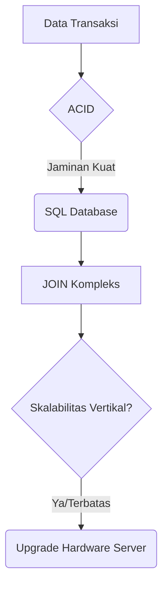
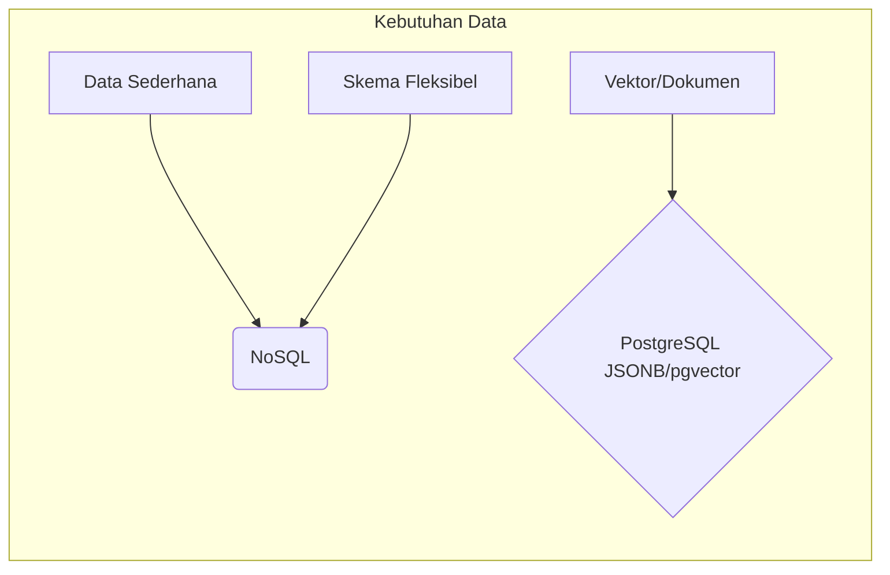
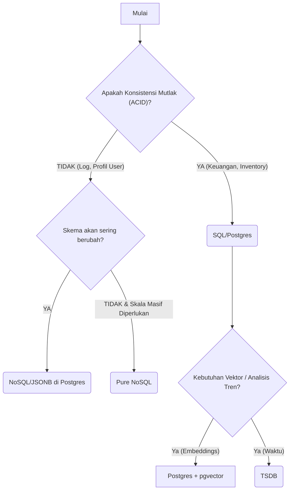

# 📚 Perbandingan Teknologi Database (SQL vs NoSQL vs TimeSeries)

Panduan ini menyajikan tinjauan perbandingan teknologi database utama, membantu Anda memilih *layer* persistensi data yang paling optimal untuk kebutuhan proyek Anda.

***

## 🐘 SQL (Relational): Struktur & Integritas
**Prinsip Utama:** Data disimpan dalam tabel terstruktur dengan skema kaku dan hubungan antar-tabel (Schema-on-Write).
**✅ Keunggulan:**
*   **Integritas Mutlak:** Dijamin oleh properti ACID. Cocok untuk data transaksi (keuangan, inventaris).
*   **Query Kompleks:** Unggul dalam *JOINs* yang rumit antara entitas berbeda.
*   **Modernisasi:** Dengan fitur seperti `JSONB` (PostgreSQL) dan `pgvector`, SQL kini bisa mengakomodasi kebutuhan dokumen fleksibel dan vektor.

### 🛡️ ACID Properties: Pilar Integritas Data
ACID adalah akronim untuk empat properti yang menjamin bahwa transaksi database berjalan secara andal, bahkan saat terjadi kegagalan sistem.

*   **Atomicity (Atomik):** Transaksi harus dianggap sebagai satu unit tunggal; semuanya berhasil (*commit*) atau tidak ada satupun yang terjadi (*rollback*).
    *   **Contoh:** Transfer uang dari Akun A ke Akun B. Jika debit di A berhasil tapi kredit di B gagal, maka seluruh transaksi dibatalkan (rollback), memastikan saldo keseluruhan tetap seimbang.

*   **Consistency (Konsistensi):** Transaksi hanya dapat mengubah data dari satu *state* yang valid ke *state* yang valid lainnya.
    *   **Contoh:** Jika aturan bisnis menyatakan jumlah stok harus non-negatif, maka transaksi tidak boleh menghasilkan nilai negatif.

*   **Isolation (Isolasi):** Beberapa transaksi yang berjalan secara bersamaan (konkuren) harus tampak seolah-olah mereka berjalan secara berurutan, satu per satu.
    *   **Contoh:** Dua pengguna mencoba memesan item terakhir pada saat yang sama. Isolasi memastikan hanya satu yang berhasil menyelesaikan pemesanan tanpa melihat perubahan data dari transaksi lain yang belum selesai.

*   **Durability (Daya Tahan):** Setelah sebuah transaksi dinyatakan sukses (*commit*), perubahannya harus permanen dan tidak hilang, bahkan jika terjadi kegagalan listrik atau *crash* sistem.
    *   **Contoh:** Anda menerima konfirmasi pembelian email. Data tersebut sudah terjamin tersimpan secara fisik di media penyimpanan (disk).

### 🟢 Keunggulan PostgreSQL untuk ACID:
PostgreSQL sangat kuat dalam mendukung keempat properti ini karena fondasinya adalah database relasional yang matang.
*   **Atomicity & Consistency:** Didukung penuh oleh transaksi SQL (`BEGIN`/`COMMIT`), memastikan operasi gagal akan otomatis *rollback*.
*   **Isolation:** Menawarkan berbagai tingkat isolasi (misalnya, `SERIALIZABLE`) yang sangat ketat untuk mencegah anomali konkurensi.
*   **Durability:** Memanfaatkan sistem penyimpanan log transaksional (WAL - Write Ahead Log) ke disk fisik secara berkala, memastikan data *commit* tidak hilang walau server mati mendadak.

---

**❌ Batasan Utama: Skalabilitas Horizontal**
SQL secara tradisional dirancang untuk **Skala Vertikal** (upgrade server tunggal). Untuk skala besar, dibutuhkan *sharding* yang kompleks agar tetap mempertahankan konsistensi ACID di banyak node berbeda.

***

## 🧩 NoSQL (Non-Relational): Fleksibilitas & Skala
**Prinsip Utama:** Menggunakan model data bervariasi (Dokumen, Key-Value, Graph). Prioritasnya adalah **Skalabilitas Horizontal** dan fleksibilitas.
**✅ Keunggulan:**
*   **Skema Dinamis:** Mudah beradaptasi dengan perubahan fitur tanpa *downtime*.
*   **Horizontal Skala Otomatis:** Sangat mudah didistribusikan ke banyak server (commodity hardware).
*   **Kinerja I/O Sederhana:** Cepat untuk operasi baca/tulis sederhana bervolume tinggi.

**⚠️ Catatan Penting: Polyglot Persistence**
Berkat fitur modern seperti **JSONB** dan `pgvector` di PostgreSQL, kebutuhan NoSQL seringkali bisa dipenuhi *di dalam* sistem SQL yang terpercaya. Ini adalah pendekatan terbaik!

***

## ⏰ Time-Series DB (TSDB): Spesialisasi Waktu
**Kapan Digunakan:** Ketika data utama Anda adalah metrik yang diindeks oleh waktu (Sensor, Log, Harga Saham).
**Fokus Kueri:** Analisis tren (`AVG`, `MAX`) dalam rentang waktu tertentu.

### ❓ Kenapa Tidak Pakai Elasticsearch untuk Time-Series?
Walaupun Elasticsearch sering digunakan untuk log (data berbasis waktu), ia memiliki beberapa kelemahan dibandingkan TSDB murni (seperti TimescaleDB) untuk data terstruktur:

1.  **Integritas Data (ACID):** Elasticsearch tidak memiliki transaksi ACID penuh. Jika konsistensi data finansial atau inventaris sangat penting, TSDB berbasis SQL lebih aman.
2.  **Relasi & Joins:** Di TSDB (SQL-based), Anda bisa dengan mudah melakukan `JOIN` antara data metrik dan tabel master (metadata). Di Elasticsearch, Anda harus melakukan denormalisasi data (menyalin metadata ke setiap dokumen), yang membuat indeks menjadi sangat besar.
3.  **Efisiensi Penyimpanan:** TSDB menggunakan kompresi kolom yang sangat efisien untuk data numerik. Elasticsearch menggunakan *inverted index* yang memakan ruang disk lebih besar karena setiap field diindeks untuk pencarian teks.
4.  **Bahasa Kueri:** SQL jauh lebih ekspresif untuk kueri analitik kompleks dibandingkan Query DSL (JSON) milik Elasticsearch.

***

## 🚀 Alur Kerja Keputusan Database (Decision Flow)

Ikuti langkah-langkah ini untuk memilih teknologi yang tepat:

**Tips:** Jangan langsung menolak SQL. Selalu periksa fitur modern pada sistem relasional Anda!

***

## 💡 Latihan Kasus: Penentuan DB Terbaik
**Skenario Data:** Sistem pelaporan penjualan & stok historis dari banyak cabang toko (Borma, Alfamart, Costco).

**Analisis Kebutuhan:**
1.  **Data Apa yang Tersimpan?** Transaksi penjualan (Tanggal, Cabang ID, SKU, Qty Terjual, Harga) dan update stok (Tanggal, Cabang ID, SKU, Jumlah Stok).
2.  **Kompleksitas Hubungan:** Tinggi. Perlu *JOIN* antara `Transaksi`, `SKU` (Master Product), dan `Cabang`.
3.  **Sifat Data:** Sangat temporal/berurutan waktu.
4.  **Konsistensi:** Sangat krusial. Pencatatan penjualan harus 100% akurat dan tidak boleh ada selisih stok akibat kegagalan transaksi (memerlukan ACID).

### ⚖️ Perbandingan Teknis & Benchmark
Untuk menentukan pilihan, pertimbangkan beban kerja (*workload*) utama:
*   **OLTP (Online Transaction Processing):** Fokus pada kecepatan baca/tulis yang sangat cepat dan konsistensi data *real-time*. **(SQL kuat)**
*   **OLAP (Online Analytical Processing):** Fokus pada menjalankan kueri agregasi kompleks di atas data historis. **(TSDB kuat)**

| Fitur | SQL (Postgres) | NoSQL/Document | TSDB (TimescaleDB) |
| :--- | :---: | :---: | :---: |
| **Konsistensi** | ✅ Tertinggi (ACID) | 🟡 Tergantung Model | ✅ Tinggi (Berbasis Transaksi) |
| **Skala Horizontal** | 🟠 Sulit (Memerlukan Sharding Manual) | ✅ Terbaik (Native) | 🟢 Sangat Baik (Time-based partitioning) |
| **Latency** | Rendah (Transaksional) | Sangat Rendah (Key Lookup) | Rendah (Read range based on time) |
| **CPU Usage** | Sedang-Tinggi (Karena JOIN & Integrity Checks) | Rendah-Sedang | Efisien (Optimasi untuk query waktu) |
| **Benchmark Fokus** | Transaksi kecil, konsistensi. | Baca/tulis cepat data tunggal. | Agregasi dan *range queries* besar. |

**Kesimpulan:** Gunakan **SQL (PostgreSQL)** untuk data master dan transaksi inti yang memerlukan ACID, kemudian gunakan fitur *extension* TSDB di Postgres atau layanan khusus TSDB untuk menyimpan data historis volume tinggi.